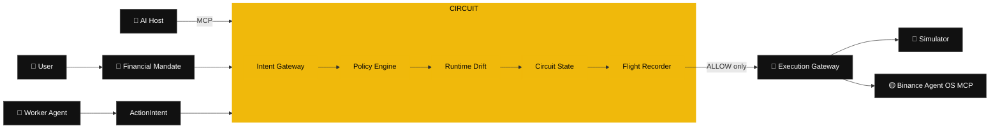

<p align="center">
  
</p>

<h1 align="center">⚡ CIRCUIT</h1>

<p align="center"><strong>The runtime control plane for agentic finance.</strong></p>

<p align="center">
  <a href="https://github.com/Ronlin1/circuit/actions/workflows/ci.yml"></a>
  
  
  
  
</p>

> **Binance Agent OS gives AI agents execution. CIRCUIT gives users runtime control.**

CIRCUIT continuously verifies that an autonomous financial agent is still acting inside the user’s activated **Financial Mandate**, behavioral envelope, evidence-freshness requirements, and market assumptions **before execution is allowed**.

Built for the **Binance Agent OS Mini Hackathon — Track A**, CIRCUIT is not another market-prediction chatbot. It is supervisory infrastructure for safer autonomous financial workflows.

---

## 🏆 The problem CIRCUIT solves

Static permissions answer **what an agent may access**. They do not fully answer whether an evolving sequence of otherwise-valid actions is still consistent with what the user authorized.

CIRCUIT contains failures such as:

- 💸 a **$100 order** under a **$10 cap**;
- 📉 a **Spot-only** strategy drifting into Futures;
- 🔁 semantic retries while a previous transaction is still uncertain;
- ⚡ individually valid orders forming an unsafe rapid-fire sequence;
- ⏱️ stale market/account evidence;
- 🌪️ a strategy continuing after a volatility-regime shift;
- 🧨 prompt-injection text attempting to rewrite the user’s financial limits.

The invariant is simple:

> **AI can interpret and explain. Deterministic code owns the veto.**

---

## ✨ What makes it different

| Layer | Typical safety tool | CIRCUIT |
|---|---|---|
| Scope | One token / one transaction | **Agent behavior over time** |
| Authorization | Static permission | **Versioned Financial Mandate** |
| Runtime | Per-call checks | **Sequence-aware drift engine** |
| Retry safety | Application-specific | **Semantic duplicate + uncertain settlement breaker** |
| Regime changes | Usually ignored | **Operating-assumption drift** |
| Audit | Logs | **SHA-256 linked Flight Recorder** |
| AI integration | Embedded model | **MCP-native supervisor surface** |
| Execution | Often coupled | **Separate explicit execution gateway** |

CIRCUIT asks the question that becomes more important as financial agents become more autonomous:

> **Is this agent still operating within the intent, behavior, and assumptions under which the user authorized it?**

---

## 🧠 Architecture



**Decision precedence:** `PAUSE > BLOCK > REVIEW > RESIZE > ALLOW`

A model-generated explanation can never downgrade a stronger deterministic verdict.

📐 **Deep architecture:** [`docs/ARCHITECTURE.md`](docs/ARCHITECTURE.md)  
🛡️ **Threat model:** [`docs/THREAT_MODEL.md`](docs/THREAT_MODEL.md)  
🎬 **2m30s demo:** [`docs/DEMO.md`](docs/DEMO.md)

---

## 🧪 Adversarial Lab

Run the Mission Control demo and attack the agent yourself:

| # | Scenario | Expected | Proof |
|---:|---|:---:|---|
| 01 | ✅ Safe Spot Buy | `ALLOW` | Valid automation still works |
| 02 | 💸 Oversize Order | `BLOCK` | Immutable per-order cap |
| 03 | 📉 Forbidden Futures | `BLOCK` | Product drift contained |
| 04 | 🔁 Duplicate Retry Loop | `PAUSE` | Uncertain settlement cannot trigger blind retries |
| 05 | ⚡ Frequency Breaker | `PAUSE` | Safe individual actions can form an unsafe sequence |
| 06 | ⏱️ Stale Evidence | `BLOCK` | Financial mutation fails closed |
| 07 | 🌪️ Regime Drift | `REVIEW` | Deployment assumptions are monitored |
| 08 | 🧨 Prompt Injection | `BLOCK` | Untrusted text cannot rewrite authorization |

Every evaluation creates a hash-linked **Flight Recorder** trace containing intent, evidence, checks, drift findings, verdict, runtime transition, and trace hashes.

---

## 🤖 MCP-native supervisor

CIRCUIT is itself an MCP server:

```text
POST /mcp/circuit
```

Compatible AI hosts can use exactly three v1 tools:

- `circuit_status` — inspect mandate/runtime/audit health;
- `circuit_evaluate_intent` — submit a typed proposal for deterministic evaluation;
- `circuit_trace_briefing` — explain an immutable recorded verdict.

### Intentionally *not* exposed to AI hosts

- ❌ financial execution;
- ❌ mandate activation;
- ❌ runtime recovery.

The agent may inspect, propose, evaluate and explain. It cannot use the supervisor surface to move money or unpause itself.

---

## 🟡 Binance Agent OS integration

Upstream MCP endpoint:

```text
https://agent.binance.com/mcp/agentic
```

`BinanceMcpAdapter` supports capability discovery, tool invocation, fail-closed auth handling, and explicit financial-tool mappings. CIRCUIT refuses to guess a trading-capable tool name.

Live execution is deliberately restricted in v1:

- **simulation by default**;
- Spot only;
- explicit authorized MCP connection required;
- explicit ticker/order-book/account/Spot-order mappings required;
- no Margin/Futures/external withdrawal path enabled by default.

> ⚠️ Hackathon software. CIRCUIT is not financial advice and does not guarantee financial safety or returns.

---

## 🚀 Quick start

**Requirements:** Node.js **22.16+**.

```bash
git clone https://github.com/Ronlin1/circuit.git
cd circuit
npm run verify
npm start
```

Open:

```text
http://localhost:3000
```

No third-party runtime package installation is required.

### Environment

```text
CIRCUIT_MODE=simulation
CIRCUIT_PORT=3000
BINANCE_MCP_URL=https://agent.binance.com/mcp/agentic
```

Never commit `.env` or live authorization material. See [`.env.example`](.env.example).

---

## ✅ Verification

One command gates the release:

```bash
npm run verify
```

It runs:

1. 🧪 all Node tests;
2. 🔎 JavaScript syntax verification;
3. 🔐 repository secret scan;
4. ⚔️ deterministic 8-scenario matrix;
5. 🔗 Flight Recorder chain verification;
6. 🌐 real local HTTP + MCP smoke flow.

GitHub Actions runs the same gate on push and pull request.

---

## 🗺️ Repository map

```text
src/domain/       immutable financial contracts
src/policy/       deterministic veto rules
src/runtime/      drift detection + state machine
src/execution/    evaluation / execution isolation
src/adapters/     simulator + Binance MCP adapter
src/trace/        hash-linked Flight Recorder
src/scenarios/    eight reproducible attacks
src/mcp/          agent-facing MCP supervisor
src/supervisor/   advisory trace briefings
src/server/       HTTP / SSE control plane
public/           black / yellow / white Mission Control
scripts/          release, smoke, syntax and secret checks
docs/             architecture, threat model and demo runbook
```

---

## 🔒 Security model

CIRCUIT is designed to **fail closed**:

- active mandates are immutable;
- worker text is never treated as policy;
- blocked/review/paused traces are not executable;
- uncertain settlement pauses instead of blindly retrying;
- live mode is opt-in and visibly distinct;
- unknown Binance MCP tool mappings stop the financial path;
- secrets are excluded from SQLite and structured logs;
- audit traces are SHA-256 chain-linked;
- recovery is explicit.

Read [`SECURITY.md`](SECURITY.md) before connecting any live financial account.

---

## 🧭 Hackathon release material

- 📐 [`docs/ARCHITECTURE.md`](docs/ARCHITECTURE.md)
- 🎬 [`docs/DEMO.md`](docs/DEMO.md)
- 🛡️ [`docs/THREAT_MODEL.md`](docs/THREAT_MODEL.md)
- ✅ [`docs/RELEASE_CHECKLIST.md`](docs/RELEASE_CHECKLIST.md)
- 🧩 [`docs/superpowers/specs/2026-09-03-circuit-design.md`](docs/superpowers/specs/2026-09-03-circuit-design.md)
- 🛠️ [`docs/superpowers/plans/2026-09-03-circuit-mvp.md`](docs/superpowers/plans/2026-09-03-circuit-mvp.md)

---

## 📜 License

MIT © 2026 Ronald Atuhaire. See [`LICENSE`](LICENSE).

Binance and related marks belong to their respective owners. CIRCUIT is an independent hackathon project and is not presented as an official Binance product.

---

<p align="center"><strong>Giving an AI access to money should not mean trusting it forever.<br>CIRCUIT makes that trust continuously verifiable.</strong></p>
