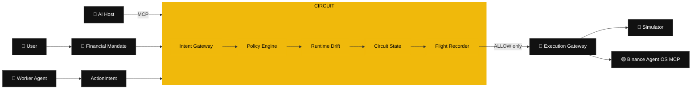

<p align="center">
  
</p>

<h1 align="center">⚡ CIRCUIT</h1>

<p align="center"><strong>The runtime control plane for agentic finance.</strong></p>

<p align="center">
  <a href="https://github.com/Ronlin1/circuit/actions/workflows/ci.yml"></a>
  
  
  
  
</p>

> **Binance Agent OS gives AI agents execution. CIRCUIT gives users runtime control.**

<p align="center">
  <a href="https://circuit-agent-os.netlify.app"><strong>🌐 Live Demo</strong></a> ·
  <a href="https://circuit-agent-os.netlify.app/proof/"><strong>🟡 Agent OS Proof</strong></a> ·
  <a href="https://circuit-agent-os.netlify.app/simulation/#judge-mode"><strong>🏁 Judge Mode</strong></a> ·
  <a href="https://circuit-agent-os.netlify.app/mission-control/"><strong>🛰 Mission Control</strong></a>
</p>

CIRCUIT continuously verifies that an autonomous financial agent is still acting inside the user’s activated **Financial Mandate**, behavioral envelope, evidence-freshness requirements, and market assumptions **before execution is allowed**.

Built for the **Binance Agent OS Mini Hackathon — Track A**, CIRCUIT is not another market-prediction chatbot. It is supervisory infrastructure for safer autonomous financial workflows.

---

## ⏱️ 60-second judge path

If you are judging CIRCUIT, use this path:

1. **Open the product:** https://circuit-agent-os.netlify.app
2. **See the real Agent OS proof:** https://circuit-agent-os.netlify.app/proof/
3. **Run Judge Mode:** https://circuit-agent-os.netlify.app/simulation/#judge-mode
4. **Inspect the control plane:** https://circuit-agent-os.netlify.app/mission-control/
5. **Read the architecture:** [`docs/ARCHITECTURE.md`](docs/ARCHITECTURE.md)

The core claim can be checked in under a minute:

```text
REAL BINANCE AGENT OS MARKET EVIDENCE
                ↓
           CIRCUIT
                ↓
$100 BNB → BLOCK
$8 BNB   → ALLOW
                ↓
0 Binance writes
```

Then Judge Mode runs the eight deterministic adversarial scenarios and compares expected versus actual containment verdicts.

---

## ✅ Verified Binance Agent OS proof

CIRCUIT was tested end-to-end in a real Codex session connected to Binance’s official Agent OS MCP endpoint and the hosted CIRCUIT MCP server.

For the final live-evidence proof, fresh BNB/USDT ticker and depth data were fetched separately for two hypothetical Spot BUY intents and passed into CIRCUIT’s deterministic evidence path through `scenarioContext`.

| Intent | Binance price | CIRCUIT evidence price | Evidence age | CIRCUIT verdict | Reason codes | Binance writes |
|---|---:|---:|---:|:---:|---|---:|
| `$100 BNB` | `745.63 USDT` | `745.63 USDT` | `0.684 s` | `BLOCK` | `ORDER_CAP_EXCEEDED`, `DAILY_BUDGET_EXCEEDED` | `0` |
| `$8 BNB` | `745.50 USDT` | `745.50 USDT` | `0.645 s` | `ALLOW` | none | `0` |

Canonical Flight Recorder traces:

```text
$100 BLOCK  5fba99e4-8280-45d2-bdaa-61da16f219a3
$8 ALLOW    777aeb09-5106-447b-8329-c25a1cfa298c
```

Both traces recorded the exact submitted Binance market price, ticker timestamp, book timestamp, and calculated spread. `EVIDENCE_STALE` was absent because both evidence snapshots were comfortably inside the active 15-second freshness window.

**Evidence boundary:** the live proof uses real Binance **market evidence**. Daily spend, concentration, drawdown, volatility, balance/portfolio assumptions, and prior-settlement state in this public proof remain CIRCUIT **simulation/default** values and are **not live Binance account data**.

The proof deliberately stopped before financial mutation: **0 Binance writes**, no trade/transfer/Convert/Margin/Futures/cancel tool was called, and the `$8` ALLOW remained behind a later human approval/execution boundary.

➡️ **Judge-facing proof page:** https://circuit-agent-os.netlify.app/proof/

---

## 🌐 Product experience

The hosted demo is split into focused surfaces so a judge or operator can understand CIRCUIT without hunting through one giant dashboard:

| Page | Purpose |
|---|---|
| **Home** | Product thesis, control-loop visual, and direct judge CTAs |
| **Agent OS Proof** | Recorded real Binance Agent OS market evidence, CIRCUIT traces, and zero-write boundary |
| **Mission Control** | Active mandate, runtime health, MCP supervisor, breaker, and Flight Recorder |
| **Simulation Lab / Judge Mode** | Eight deterministic adversarial scenarios with expected vs actual verdicts and one-click judge summary |
| **How it Works** | Financial Mandate → Policy Engine → Runtime Drift → Execution Gateway → Flight Recorder |
| **Live Agents** | MCP integration path plus the explicit real-money production hardening boundary |
| **About** | CIRCUIT origin story, thesis, and design principles |

The public Netlify deployment is **simulation-first**. It does not contain trading credentials and does not enable live financial execution.

---

## 🏆 The problem CIRCUIT solves

Static permissions answer **what an agent may access**. They do not fully answer whether an evolving sequence of otherwise-valid actions is still consistent with what the user authorized.

CIRCUIT contains failures such as:

- 💸 a **$100 order** under a **$10 cap**;
- 📉 a **Spot-only** strategy drifting into Futures;
- 🔁 semantic retries while a previous transaction is still uncertain;
- ⚡ individually valid orders forming an unsafe rapid-fire sequence;
- ⏱️ stale market/account evidence;
- 🌪️ a strategy continuing after a volatility-regime shift;
- 🧨 prompt-injection text attempting to rewrite the user’s financial limits.

The invariant is simple:

> **AI can interpret and explain. Deterministic code owns the veto.**

---

## ✨ What makes it different

| Layer | Typical safety tool | CIRCUIT |
|---|---|---|
| Scope | One token / one transaction | **Agent behavior over time** |
| Authorization | Static permission | **Versioned Financial Mandate** |
| Runtime | Per-call checks | **Sequence-aware drift engine** |
| Retry safety | Application-specific | **Semantic duplicate + uncertain settlement breaker** |
| Regime changes | Usually ignored | **Operating-assumption drift** |
| Audit | Logs | **SHA-256 linked Flight Recorder** |
| AI integration | Embedded model | **MCP-native supervisor surface** |
| Execution | Often coupled | **Separate explicit execution gateway** |

CIRCUIT asks the question that becomes more important as financial agents become more autonomous:

> **Is this agent still operating within the intent, behavior, and assumptions under which the user authorized it?**

---

## 🧠 Architecture



**Decision precedence:** `PAUSE > BLOCK > REVIEW > RESIZE > ALLOW`

A model-generated explanation can never downgrade a stronger deterministic verdict.

📐 **Deep architecture:** [`docs/ARCHITECTURE.md`](docs/ARCHITECTURE.md)  
🛡️ **Threat model:** [`docs/THREAT_MODEL.md`](docs/THREAT_MODEL.md)  
🎬 **Demo runbook:** [`docs/DEMO.md`](docs/DEMO.md)

---

## 🧪 Adversarial Lab + Judge Mode

Run the Simulation Lab and attack the agent yourself:

| # | Scenario | Expected | Proof |
|---:|---|:---:|---|
| 01 | ✅ Safe Spot Buy | `ALLOW` | Valid automation still works |
| 02 | 💸 Oversize Order | `BLOCK` | Immutable per-order cap |
| 03 | 📉 Forbidden Futures | `BLOCK` | Product drift contained |
| 04 | 🔁 Duplicate Retry Loop | `PAUSE` | Uncertain settlement cannot trigger blind retries |
| 05 | ⚡ Frequency Breaker | `PAUSE` | Safe individual actions can form an unsafe sequence |
| 06 | ⏱️ Stale Evidence | `BLOCK` | Financial mutation fails closed |
| 07 | 🌪️ Regime Drift | `REVIEW` | Deployment assumptions are monitored |
| 08 | 🧨 Prompt Injection | `BLOCK` | Untrusted text cannot rewrite authorization |

**Judge Mode** runs the whole matrix in one click and reports expected-versus-actual outcomes. The target judge summary is **8 / 8 expected controls**.

Every evaluation creates a hash-linked **Flight Recorder** trace containing intent, evidence, checks, drift findings, verdict, runtime transition, and trace hashes.

➡️ https://circuit-agent-os.netlify.app/simulation/#judge-mode

---

## 🤖 MCP-native supervisor

CIRCUIT is itself an MCP server:

```text
POST /mcp/circuit
```

Compatible AI hosts can use exactly three v1 tools:

- `circuit_status` — inspect mandate/runtime/audit health;
- `circuit_evaluate_intent` — submit a typed proposal for deterministic evaluation;
- `circuit_trace_briefing` — explain an immutable recorded verdict.

### Intentionally *not* exposed to AI hosts

- ❌ financial execution;
- ❌ mandate activation;
- ❌ runtime recovery.

The agent may inspect, propose, evaluate and explain. It cannot use the supervisor surface to move money or unpause itself.

---

## 🟡 Binance Agent OS integration

Upstream MCP endpoint:

```text
https://agent.binance.com/mcp/agentic
```

`BinanceMcpAdapter` supports capability discovery, tool invocation, fail-closed auth handling, and explicit financial-tool mappings. CIRCUIT refuses to guess a trading-capable tool name.

The live proof used read-only Binance tools discovered from the actual MCP surface:

```text
spot.ticker24hr
spot.depth
```

Live execution remains deliberately restricted in v1:

- **simulation by default**;
- Spot only;
- explicit authorized MCP connection required;
- explicit ticker/order-book/account/Spot-order mappings required;
- no Margin/Futures/external withdrawal path enabled by default.

> ⚠️ Hackathon software. CIRCUIT is not financial advice and does not guarantee financial safety or returns.

---

## 🤖 CIRCUIT Supervisor Agent

The explicit supervisor orchestration layer keeps the planner separate from the execution adapter. The planner can propose a typed financial intent, but it never receives Binance execution access. CIRCUIT evaluates the proposal first; `BLOCK`, `REVIEW`, and `PAUSE` terminate the run, while `ALLOW` / `RESIZE` still stop at a separate human approval gate before execution.

Run the deterministic proof locally:

```bash
npm run agent:demo
```

Expected proof:

```text
$100 BNB -> BLOCK -> ORDER_CAP_EXCEEDED
$8 BNB -> ALLOW -> AWAITING_APPROVAL
Binance executions: 0
```

For the real Binance Agent OS read-only proof, use [`agent/CIRCUIT_SUPERVISOR.md`](agent/CIRCUIT_SUPERVISOR.md), the runbook in [`docs/AGENT_OS_LIVE_DEMO.md`](docs/AGENT_OS_LIVE_DEMO.md), and the recorded judge-facing result at https://circuit-agent-os.netlify.app/proof/.

---

## 🚀 Quick start

**Requirements:** Node.js **22.16+**.

```bash
git clone https://github.com/Ronlin1/circuit.git
cd circuit
npm run verify
npm start
```

Open:

```text
http://localhost:3000
```

No third-party runtime package installation is required.

### Environment

```text
CIRCUIT_MODE=simulation
CIRCUIT_PORT=3000
BINANCE_MCP_URL=https://agent.binance.com/mcp/agentic
```

Never commit `.env` or live authorization material. See [`.env.example`](.env.example).

---

## ✅ Verification

One command gates the release:

```bash
npm run verify
```

It runs:

1. 🧪 all Node tests;
2. 🔎 JavaScript syntax verification;
3. 🔐 repository secret scan;
4. ⚔️ deterministic 8-scenario matrix;
5. 🔗 Flight Recorder chain verification;
6. 🌐 real local HTTP + MCP smoke flow.

GitHub Actions runs the same gate on push and pull request.

---

## 🗺️ Repository map

```text
src/domain/       immutable financial contracts
src/policy/       deterministic veto rules
src/runtime/      drift detection + state machine
src/execution/    evaluation / execution isolation
src/adapters/     simulator + Binance MCP adapter
src/agent/        Supervisor Agent orchestration + live proof helpers
src/trace/        hash-linked Flight Recorder
src/scenarios/    eight reproducible attacks
src/mcp/          agent-facing MCP supervisor
src/supervisor/   advisory trace briefings
src/server/       HTTP / SSE control plane
public/proof/     judge-facing recorded Agent OS proof
public/simulation Judge Mode + scenario lab
scripts/          release, smoke, syntax and secret checks
docs/             architecture, threat model, demo and submission package
```

---

## 🔒 Security model

CIRCUIT is designed to **fail closed**:

- active mandates are immutable;
- worker text is never treated as policy;
- blocked/review/paused traces are not executable;
- uncertain settlement pauses instead of blindly retrying;
- live mode is opt-in and visibly distinct;
- unknown Binance MCP tool mappings stop the financial path;
- secrets are excluded from SQLite and structured logs;
- audit traces are SHA-256 chain-linked;
- recovery is explicit.

Read [`SECURITY.md`](SECURITY.md) before connecting any live financial account.

---

## 🧭 Hackathon release material

- 🏁 [`docs/SUBMISSION.md`](docs/SUBMISSION.md) — judge links, verified proof facts, claim boundary, and final submission checklist
- 📐 [`docs/ARCHITECTURE.md`](docs/ARCHITECTURE.md)
- 🎬 [`docs/DEMO.md`](docs/DEMO.md)
- 🛡️ [`docs/THREAT_MODEL.md`](docs/THREAT_MODEL.md)
- ✅ [`docs/RELEASE_CHECKLIST.md`](docs/RELEASE_CHECKLIST.md)
- 🧩 [`docs/superpowers/specs/2026-09-03-circuit-design.md`](docs/superpowers/specs/2026-09-03-circuit-design.md)
- 🛠️ [`docs/superpowers/plans/2026-09-03-circuit-mvp.md`](docs/superpowers/plans/2026-09-03-circuit-mvp.md)

---

## 📜 License

MIT © 2026 Ronald Atuhaire. See [`LICENSE`](LICENSE).

Binance and related marks belong to their respective owners. CIRCUIT is an independent hackathon project and is not presented as an official Binance product.

---

<p align="center"><strong>Giving an AI access to money should not mean trusting it forever.<br>CIRCUIT makes that trust continuously verifiable.</strong></p>
