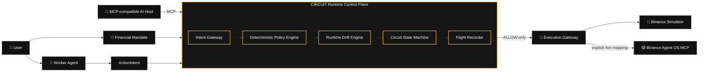
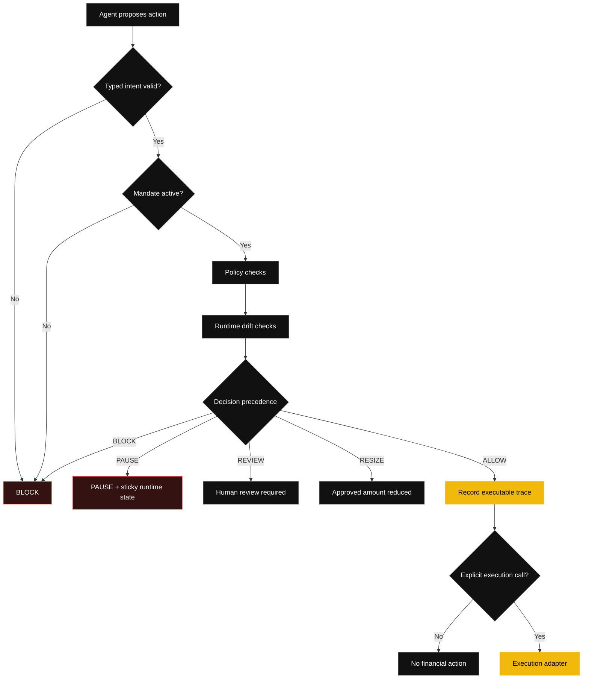
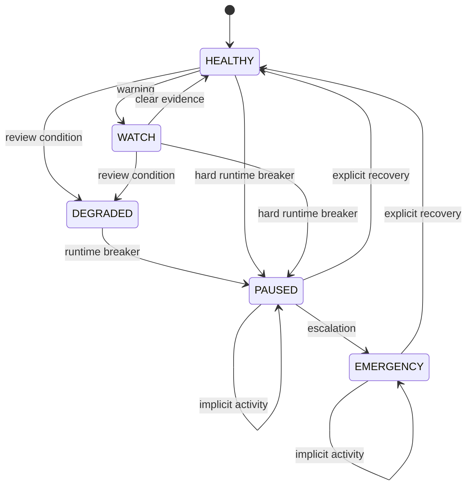
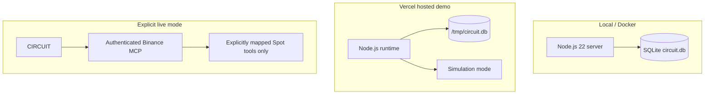

# ⚡ CIRCUIT Architecture

> **Runtime control infrastructure for autonomous financial agents.**

CIRCUIT sits between an AI agent and financial execution. The AI may reason, propose and explain. The deterministic CIRCUIT core decides whether the proposal is allowed to become executable.

## 1. System architecture

## 2. Decision pipeline

Decision precedence is immutable:

`PAUSE > BLOCK > REVIEW > RESIZE > ALLOW`

Model-generated text cannot downgrade a stronger verdict.

## 3. Runtime state machine

`PAUSED` and `EMERGENCY` are sticky. An agent cannot recover itself through the MCP supervisor surface.

## 4. Trust boundaries

## 5. MCP composition

CIRCUIT exposes only advisory/supervisory MCP tools in v1:

- `circuit_status`
- `circuit_evaluate_intent`
- `circuit_trace_briefing`

It intentionally does **not** expose:

- financial execution;
- mandate activation;
- runtime recovery.

This means a connected AI host can inspect, propose, evaluate and explain without gaining a path to bypass the human-controlled execution boundary.

## 6. Persistence and audit

Every evaluated action produces a trace containing:

1. user/agent intent;
2. mandate version;
3. normalized evidence;
4. policy checks;
5. runtime drift findings;
6. final verdict;
7. runtime state transition;
8. previous trace hash;
9. current SHA-256 trace hash.

The Flight Recorder is **tamper-evident**, not a blockchain ledger.

## 7. Deployment model

The hosted demo defaults to **SIMULATION**. Live Binance execution remains opt-in and fails closed until an authenticated session and explicit tool mappings are supplied.

## 8. Repository modules

| Module | Responsibility |
|---|---|
| `src/domain/` | Immutable typed financial contracts |
| `src/policy/` | Deterministic financial veto rules |
| `src/runtime/` | Drift detection and circuit state |
| `src/execution/` | Evaluation/execution isolation |
| `src/adapters/` | Simulator and Binance MCP bridge |
| `src/trace/` | Hash-linked Flight Recorder |
| `src/mcp/` | MCP-native supervisor interface |
| `src/server/` | HTTP/SSE control plane |
| `src/scenarios/` | Reproducible adversarial demonstrations |
| `public/` | Black/yellow/white Mission Control |

See also [`THREAT_MODEL.md`](THREAT_MODEL.md), [`DEMO.md`](DEMO.md), and the full design spec in [`superpowers/specs/2026-09-03-circuit-design.md`](superpowers/specs/2026-09-03-circuit-design.md).
